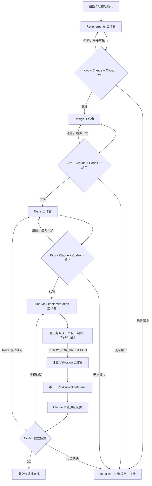

# 当前监督 Loop 合同

> 发布状态：范围基线。本文脱敏描述已经实际运行的协调行为，不包含私有仓库内容、真实任务标识、会话记录或机器路径。

## 目的

本 loop 在 cc-sdd 现有方法之外提供第二层监督，但不取代任何 Kiro 阶段。它解决的是“谁在隔离上下文中执行、谁进行第二模型审查、谁有权批准，以及中断后如何继续”，而不是“如何生成 Requirements、Design、Tasks 或实现代码”。

## 术语

- **cc-sdd 方法 loop**：cc-sdd 已有的规格生成、阶段内审查、逐任务实现/调试、完成性核验和功能级 Validation。
- **监督 loop**：Codex 主任务围绕现有 skills 进行阶段调度、外部 Claude gate、证据核验和批准推进的固定五阶段流程。
- **监督者**：面向用户的 Codex 主任务。它保持任务全局意图和状态，但不执行阶段产出。
- **阶段工作者**：专门执行一个阶段的可见 Codex Desktop 任务。
- **Claude gate**：Claude Code 针对阶段产物或最终验证证据提供的只读对抗性第二意见。
- **状态账本**：支持恢复和防止非法推进的小型运行状态文件；它不是事件来源或通用工作流数据库。
- **未来 graph 工程**：可能独立研究的通用抽象，明确不属于当前移植范围。

## 职责边界

| 角色 | 负责 | 不得负责 |
| --- | --- | --- |
| 用户 | 产品意图、范围变化、外部写入和交付授权 | 日常技术核验 |
| Codex 监督者 | 预检、阶段任务调度、证据核验、批准写入、提交阶段产物、恢复与升级 | 编写规格、实现任务、执行最终 Validation、盲从 Claude |
| Codex 阶段工作者 | 调用一个阶段的原始 cc-sdd skill、产出/修订阶段内容、返回结构化证据 | 自我批准、推进下一阶段、推送或发布 |
| Claude reviewer | 从第一性原理做只读对抗性审查并给出结构化结论 | 修改真实 worktree、写入 Kiro 批准、决定阶段转换、运行另一套完整 Kiro 流程 |
| `/kiro-impl` 内部角色 | 逐任务实现、独立审查、调试和完成性核验 | 监督模式下的功能级最终验收 |

审批顺序为：原始 Kiro gate → Claude 只读审查 → Codex 监督者独立核验。三者缺一都不得批准。

## 固定阶段流程

Requirements 阶段可根据 brownfield 情况调用 `/kiro-validate-gap`；Design 阶段继续调用已有 design validation；Tasks 阶段继续使用已有任务计划审查。监督 loop 不复制这些能力。

## 阶段合同

| 阶段 | Codex 工作者配置 | 原始 gate | Claude 对象 | 批准结果 |
| --- | --- | --- | --- | --- |
| Requirements | 继承监督者模型/思考 | Requirements review；必要时 gap validation | 完整性、歧义、事实一致性、可验证性 | 监督者写 Requirements approval |
| Design | 继承监督者模型/思考 | Design review 与 design validation | 架构、接口、不变量、需求可追溯性 | 监督者写 Design approval |
| Tasks | 继承监督者模型/思考 | Task plan review | 覆盖、依赖、边界、可执行性 | 监督者写 Tasks approval/readiness |
| Implementation | `gpt-5.6-luna` / `max` | `/kiro-impl` 逐任务 loop | 无额外阶段 Claude gate | 返回 `READY_FOR_VALIDATION` |
| Validation | 继承监督者模型/思考 | 唯一一次 `/kiro-validate-impl` | 审查验证范围、证据和遗漏；必要时针对性复验 | Codex GO + Claude APPROVED + 监督者核验 |

`ready_for_implementation` 只表示规格具备实现资格。它不代表实现完成，也不能替代用户对监督运行的授权。

## 单阶段共识

1. 工作者完成原始 gate 并返回结构化 handoff。
2. Codex 为 Claude 准备阶段 dossier，只包含本轮必要目标、产物、基线、声明和已有证据。
3. Claude 返回 `APPROVED`、`CHANGES_REQUIRED` 或 `BLOCKED`，并给出可定位证据。
4. Codex 独立核验每项 finding：接受正确问题，使用源码或可执行证据驳回错误问题。
5. 需要返修时恢复同一个 Codex 工作者和同一个 Claude session。
6. 最多三轮仍不能一致时停止；只有真正的产品/范围决策才请求用户处理。

Claude 的 verdict 只是证据，不能直接改写 `spec.json` 或状态账本。

## 会话、模型与权限

- 监督运行开始时冻结 Codex 主任务的模型和思考配置。
- Requirements、Design、Tasks 和 Validation 显式继承该配置。
- Implementation 显式使用 Luna Max；这一产品策略记录在 skill 中，不抽象为 provider runtime。
- Claude wrapper 不覆盖用户默认模型和思考强度。
- Claude 运行于 bypass permission，但真实 worktree 通过操作系统级只读挂载保护；bypass 不能替代隔离。
- 同阶段第 2/3 轮必须恢复已记录的 Claude session。无法恢复时记录 continuity break 并重新建立证据，不能伪装为连续会话。
- 新阶段使用新 Claude session，避免一个会话累积整条规格历史。

## 状态与恢复不变量

1. 状态必须绑定准确仓库、Git common dir、worktree、分支、基线和监督者身份。
2. 同一时刻只允许一个监督者持有运行锁；接管必须记录原因。
3. 阶段只能按 Requirements → Design → Tasks → Implementation → Validation 推进。
4. 上游规格语义被修改后，下游批准/readiness 必须按固定规则失效。
5. 历史证据指向相应提交中的产物快照；当前 `spec.json` 只代表最新批准状态。
6. Implementation 不要求不存在的 Claude 阶段报告或 phase approval。
7. `complete` 必须验证最终 Codex GO、Claude APPROVED、监督者核验和预期提交/清洁度证据。
8. 状态或会话不完整时 fail closed；不得猜测旧任务 ID、会话 ID 或结论。

## Validation 唯一所有者

cc-sdd 当前 autonomous `/kiro-impl` 会自动执行 `/kiro-validate-impl`。监督 loop 又要求独立 Validation 任务，因此必须显式改变监督模式下的职责：

- `/kiro-impl` 默认 `--final-validation run`，保持现有独立使用行为；
- `kiro-supervise` 调用 `--final-validation deferred`；
- Implementation 只在逐任务完成和核验后返回 `READY_FOR_VALIDATION`；
- Validation 工作者执行唯一一次功能级验证；
- Claude 先审查结果，只有证据不足或结论可疑时才补跑针对性检查。

这项改变消除重复工作，同时保留“最终验证使用全新 Codex 上下文”的现有监督语义。

## 明确边界

本合同只定义一条固定 loop。不得以实现本合同为由引入可配置 graph、event reducer、provider adapter、storage/lease、可视化编辑器或多工作流运行时。若未来确实需要这些能力，应使用新的 Issue 和独立证据重新论证。
