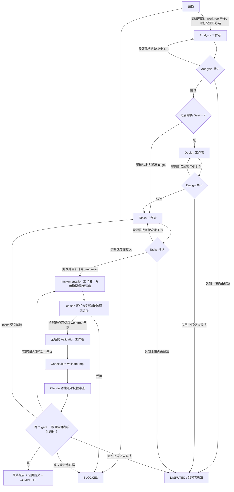
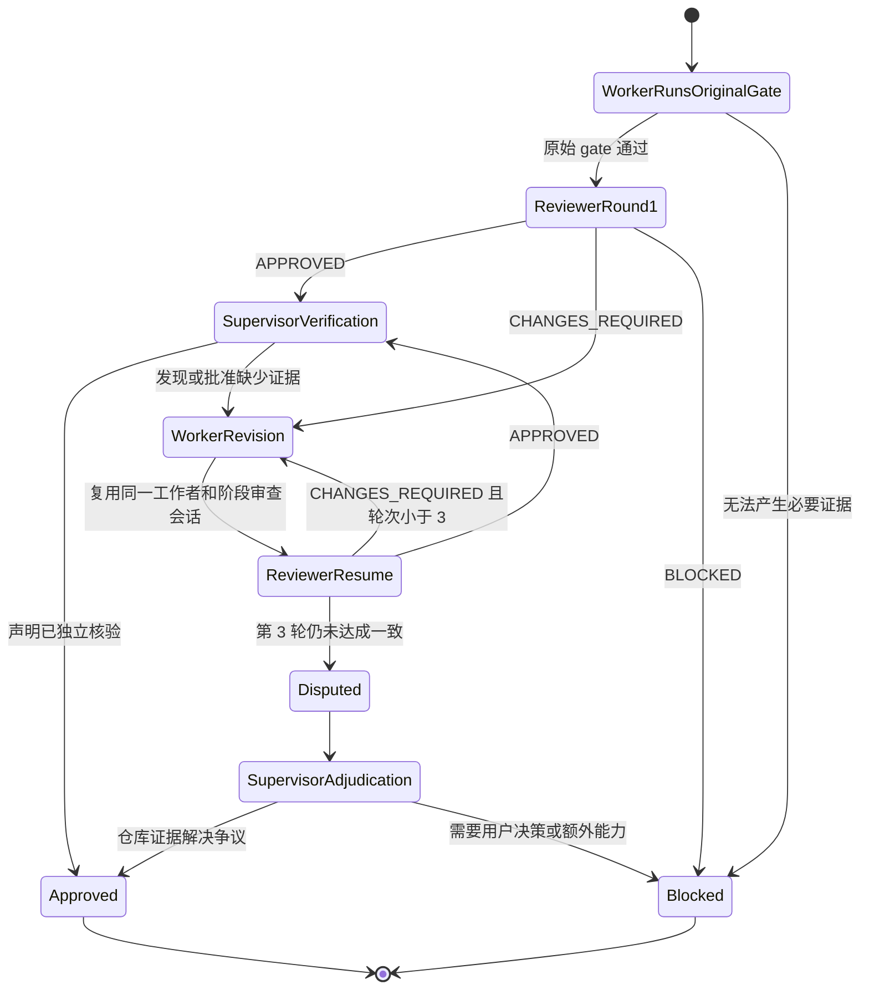

# Harness v1 决策图

> 发布状态：草案。这是对某个私有下游 harness 的脱敏重建，不包含仓库内容、功能名称、任务标识、会话记录或机器本地路径。

## 目的与基线

本文档固化通用化 harness 之前必须理解的行为。它描述行为模型，但不声称每条转换目前都已由代码强制执行。

目标上游基线是 `gotalab/cc-sdd` 的 `main` 分支提交 `29aee950f4addc36f9aeecb9881c46540e71ecc9`（核验于 2026-08-14）。该上游已经是 cc-sdd v3，而不是早期仅包含命令的架构。它已经提供：

- 面向 Codex 和 Claude Code 的 Agent Skills；
- 自主运行的 `/kiro-impl`，每轮处理一个任务；
- 全新的实现者、独立审查者和有界调试者角色；
- 在宣称实现成功前运行 `/kiro-verify-completion`；以及
- 独立的 `/kiro-validate-impl`，用于功能级集成、需求、设计和完整测试集证据验证。

因此，不应将下游 harness 描述为“给 cc-sdd 增加审查”。它的独立职责是跨代理监督：持久化监督者、隔离的阶段工作者、外部对抗性审查者、明确授权、可恢复性、证据溯源，以及阶段推进前达成一致。

## 角色与权限

| 角色 | 负责 | 不得负责 |
| --- | --- | --- |
| 用户 | 产品意图、范围扩张、外部写入授权 | 日常技术裁决 |
| 监督者 | 运行身份、阶段调度、证据核验、批准状态、转换决策 | 编写规格、实现任务、执行功能验证 |
| 阶段工作者 | 一个有界阶段、原始 cc-sdd/Kiro skill、在同一阶段任务内修订 | 自我批准、推进状态图、对外发布 |
| Claude 审查者 | 只读对抗性发现和结构化结论 | 编辑真实 worktree、写入批准账本、触发状态图转换 |
| cc-sdd `/kiro-impl` 内部角色 | 逐任务的实现者/审查者/调试者循环 | 功能级最终验收 |
| 状态引擎 | 合法转换检查、持久事件、投影、溯源 | 产品判断 |

权限顺序为：用户约束 → 监督策略 → 原始 cc-sdd gate → 外部审查证据。审查结论只是监督者的输入，不是第二套批准账本。

## 端到端状态图

## 单阶段共识循环

该循环直接适用于 Analysis、Design 和 Tasks，并通过阶段特定证据适用于功能级 Validation。Implementation 已有上游逐任务审查循环；在那里增加另一个通用阶段审查者会造成职责重复。

审查会话的连续性以阶段为边界。第 2 或第 3 轮继续使用同一个 Claude 会话。在同一阶段内启用新审查会话，必须记录连续性中断。新阶段通常启动新的审查上下文，并接收有界证据档案，而不是完整的历史会话记录。

## 阶段契约

| 阶段 | 原始 cc-sdd/Kiro gate | 外部审查对象 | 验收产物 | 下一转换 |
| --- | --- | --- | --- | --- |
| Analysis | Requirements；适用时执行 brownfield gap validation | 需求完整性、歧义、与事实来源的一致性 | Requirements、审查报告、批准/readiness 投影 | Design 或 Tasks |
| Design | Design 及 design validation | 架构、接口、不变量、可追溯性 | Design、研究证据、报告、批准/readiness 投影 | Tasks |
| Tasks | 任务生成及任务计划/任务图审查 | 覆盖度、边界、依赖、可验证性 | Tasks、报告、readiness 投影 | Implementation |
| Implementation | 自主 `/kiro-impl` | 上游逐任务审查者/调试者，而非第二套阶段账本 | 选择性任务提交和实现笔记 | Validation |
| Validation | 全新的 `/kiro-validate-impl` | 针对已记录实现的功能级对抗性验证 | 最终验证报告和证据引用 | Complete 或修复循环 |

`ready_for_implementation` 只表示具备资格，不代表实现完成，也不构成独立授权。授权来自显式启动的监督运行及其外部写入边界。

## 失效传播规则

| 语义变更 | 失效范围 | 保留内容 |
| --- | --- | --- |
| Analysis | Analysis、Design、Tasks、实现 readiness | 既有事件历史 |
| Design | Design、Tasks、实现 readiness | 仍然适用的 Analysis 验收证据 |
| Tasks | Tasks、实现 readiness | 仍然适用的 Analysis 和 Design 验收证据 |
| 仅实现账本变化 | 当前 Validation 结果 | 已批准的 Tasks 语义 |
| 实现暴露任务契约变更 | Tasks 及下游结果 | 仅在监督者重新核验后保留更早阶段 |

失效操作应追加事件并派生新的投影，不得改写历史批准证据。

## 代码强制与文档约定的边界

| 关注点 | v1 helper 的强制程度 | 状态图内核需要补齐的缺口 |
| --- | --- | --- |
| Worktree 身份和分支祖先关系 | 状态操作时强制 | 作为 workspace adapter 的前置条件保留 |
| 单一监督者所有权和文件锁 | 已强制 | 通用化为 lease/owner capability，不包含 provider 特定 ID |
| 产物/报告/提交证据 | approved/archived 阶段已强制 | 使用不可变证据引用和类型化证据要求 |
| 审查轮次/会话连续性 | wrapper 部分强制并写入状态 | 将轮次和会话转换合法性纳入 reducer |
| 阶段顺序和前置条件 | 主要依赖文档 | 由代码拒绝非法转换 |
| 终态完成证据 | 主要依赖文档；可独立标记完成 | 仅在终态不变量成立时派生完成状态 |
| 失效传播 | 主要依赖文档 | 编码为状态图策略并测试每条边 |
| Harness/策略版本 | 状态中未固定 | 固定 graph、policy、adapter、prompt 和 schema 版本 |
| 故障学习 | 可变快照，仅保留有限历史 | 追加式事件账本、故障分类、回放 fixture |
| 预算/用量限制 | 未表示 | 节点和审查级预算，并记录停止原因 |

## 已知的 v1 缺陷与歧义

1. 多个阶段把同一个可变批准账本记录为不可变产物。后续合法批准更新会导致更早阶段的验证失败。历史证据必须引用已提交的不可变快照；当前账本应是投影或指针。
2. 总体协议写明每个阶段都调用外部审查者，但产物表又声明 Implementation 不存在独立阶段审批。合理语义应是：Implementation 期间由上游执行逐任务审查，随后在 Validation 中执行外部功能级审查。
3. 当前阶段状态混合了工作者生命周期、产物批准、任务归档和运行结果。这些必须拆分为不同事实或投影。
4. 终态完成通过命令设置，而不是由全部必要证据派生。
5. Provider 名称、结论词汇和特殊 Implementation 运行配置嵌入状态模型，应移入 adapter 和 policy。
6. 状态文件是可变快照，无法确定性回放或评估决策历史。
7. 审查者拥有较宽的仓库/工具访问能力，但没有强制 token、工具调用、时间或证据预算。
8. 每阶段使用全新审查者有利于保持独立性，但重复且无界的上下文发现会浪费额度。合理平衡点是有界阶段档案加阶段内会话复用。

## 目标不变量

给定相同的状态图版本、策略版本、有序事件、不可变证据摘要和 adapter 结果，reducer 必须产生相同的当前状态与相同的合法后续动作集合。任何模型都不得直接修改派生状态。
